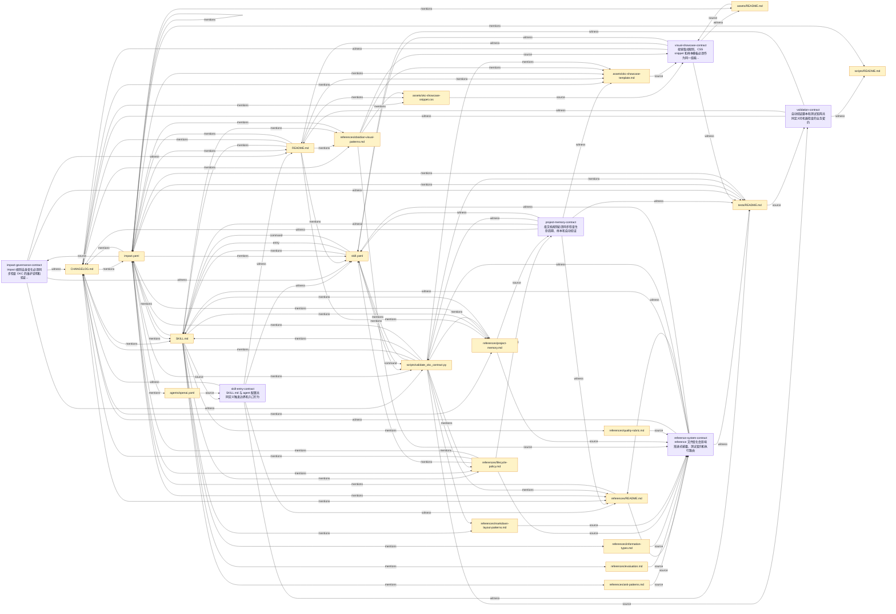

# obsidian-knowledge-curator Impact 关系图谱

> 此文件由 `pnpm skill:impact <skill-id> --visualize` 生成，用于让用户阅读 impact 契约关系。CI 的事实源仍是 skill 根目录的 `impact.yaml`。

## 30 秒读法

- Skill：`obsidian-knowledge-curator`
- 版本：`0.4.3`
- 节点数：27
- 边数：114
- 契约组：6

## 图谱

## 契约组

| 契约 | 说明 | Sources | Witnesses |
| --- | --- | --- | --- |
| `skill-entry-contract` | SKILL.md 与 agent 配置共同定义触发边界和入口行为 | `SKILL.md` `agents/openai.yaml` | `README.md` `references/README.md` `tests/README.md` `skill.yaml` `CHANGELOG.md` |
| `reference-system-contract` | reference 文件变化会影响渐进式披露、测试契约和执行路由 | `references/*.md` | `SKILL.md` `references/README.md` `tests/README.md` `scripts/validate_okc_contract.py` `skill.yaml` `CHANGELOG.md` |
| `project-memory-contract` | 母文档规则必须同步检查生命周期、样本和自动验证 | `references/project-memory.md` `references/lifecycle-policy.md` | `SKILL.md` `references/README.md` `tests/README.md` `assets/okc-showcase-template.md` `scripts/validate_okc_contract.py` `skill.yaml` `CHANGELOG.md` |
| `visual-showcase-contract` | 视觉版式规则、CSS snippet 和样本模板必须作为同一组能力维护 | `references/obsidian-visual-patterns.md` `assets/*` | `README.md` `tests/README.md` `assets/README.md` `skill.yaml` `CHANGELOG.md` |
| `validation-contract` | 自动验证脚本和测试矩阵共同定义可机器检查的业务契约 | `scripts/*.py` `tests/README.md` | `README.md` `scripts/README.md` `skill.yaml` `CHANGELOG.md` |
| `impact-governance-contract` | impact 规则自身变化必须同步检查 OKC 的维护说明和验证闭环 | `impact.yaml` | `README.md` `tests/README.md` `scripts/validate_okc_contract.py` `skill.yaml` `CHANGELOG.md` |

## 文件节点

| 文件 | 类型 | 状态 | 角色 |
| --- | --- | --- | --- |
| `agents/openai.yaml` | agents | 已变更 / 已覆盖 | `source:skill-entry-contract` |
| `assets/okc-showcase-snippet.css` | assets | 已变更 / 已覆盖 | `source:visual-showcase-contract` |
| `assets/okc-showcase-template.md` | assets | 已变更 / 已覆盖 | `witness:project-memory-contract` `source:visual-showcase-contract` |
| `assets/README.md` | assets | 已变更 / 已覆盖 | `source:visual-showcase-contract` `witness:visual-showcase-contract` |
| `CHANGELOG.md` | core | 已变更 / 已覆盖 | `witness:skill-entry-contract` `witness:reference-system-contract` `witness:project-memory-contract` `witness:visual-showcase-contract` `witness:validation-contract` `witness:impact-governance-contract` |
| `impact.yaml` | core | 已变更 / 已覆盖 | `source:impact-governance-contract` |
| `README.md` | core | 已变更 / 已覆盖 | `witness:skill-entry-contract` `witness:visual-showcase-contract` `witness:validation-contract` `witness:impact-governance-contract` |
| `references/anti-patterns.md` | references | 已变更 / 已覆盖 | `source:reference-system-contract` |
| `references/evaluation.md` | references | 已变更 / 已覆盖 | `source:reference-system-contract` |
| `references/information-types.md` | references | 已变更 / 已覆盖 | `source:reference-system-contract` |
| `references/lifecycle-policy.md` | references | 已变更 / 已覆盖 | `source:reference-system-contract` `source:project-memory-contract` |
| `references/markdown-layout-patterns.md` | references | 已变更 / 已覆盖 | `source:reference-system-contract` |
| `references/obsidian-visual-patterns.md` | references | 已变更 / 已覆盖 | `source:reference-system-contract` `source:visual-showcase-contract` |
| `references/project-memory.md` | references | 已变更 / 已覆盖 | `source:reference-system-contract` `source:project-memory-contract` |
| `references/quality-rubric.md` | references | 已变更 / 已覆盖 | `source:reference-system-contract` |
| `references/README.md` | references | 已变更 / 已覆盖 | `witness:skill-entry-contract` `source:reference-system-contract` `witness:reference-system-contract` `witness:project-memory-contract` |
| `scripts/README.md` | scripts | 已变更 / 已覆盖 | `witness:validation-contract` |
| `scripts/validate_okc_contract.py` | scripts | 已变更 / 已覆盖 | `witness:reference-system-contract` `witness:project-memory-contract` `source:validation-contract` `witness:impact-governance-contract` |
| `SKILL.md` | core | 已变更 / 已覆盖 | `source:skill-entry-contract` `witness:reference-system-contract` `witness:project-memory-contract` |
| `skill.yaml` | core | 已变更 / 已覆盖 | `witness:skill-entry-contract` `witness:reference-system-contract` `witness:project-memory-contract` `witness:visual-showcase-contract` `witness:validation-contract` `witness:impact-governance-contract` |
| `tests/README.md` | tests | 已变更 / 已覆盖 | `witness:skill-entry-contract` `witness:reference-system-contract` `witness:project-memory-contract` `witness:visual-showcase-contract` `source:validation-contract` `witness:impact-governance-contract` |
