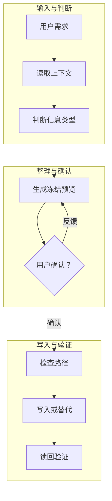

# 示例项目上下文

> [!summary] 30 秒读法
> 这是一份项目母文档的阅读入口：先说明项目为什么存在，再用架构图和状态表帮助用户恢复上下文，最后把决策和未闭环事项绑定到来源迭代。

## 1. 项目目标

> [!info] 目标一句话
> 让未来用户和 Agent 能在短时间内理解项目背景、当前状态、关键决策和下一步动作。

项目目标：

1. 保留真正值得复用的信息，而不是保存任务流水。
2. 把信息组织成用户愿意读的笔记。
3. 用 Markdown 与 Obsidian 兼容能力改善结构和版式。

> [!decision] 当前口径
> 视觉样式只作为阅读辅助；如果结构和视觉冲突，先修 Markdown 信息结构，再调 CSS。

## 2. 架构总览

> [!info] 图示读法
> 这张图按阶段阅读：每一行内部横向推进，阶段之间向下扩展。图只负责扫一眼理解，表格负责精确定义。

| 架构层 | 职责 | 不负责 | 产物 |
| --- | --- | --- | --- |
| 输入与判断 | 识别用户真正想留下什么。 | 直接写入文件。 | 目标读者、信息类型。 |
| 整理与确认 | 生成可读预览并等待反馈。 | 静默覆盖旧文件。 | 冻结预览。 |
| 写入与验证 | 检查路径、写入、读回验证。 | 创建未经确认的新路径。 | 已落盘笔记。 |

## 3. 当前状态

| 维度 | 状态 | 下一步 |
| --- | --- | --- |
| 结构 | 已建立母文档骨架。 | 继续补齐证据和边界。 |
| 版式 | 已使用 scoped CSS。 | 在 Obsidian 中做实际渲染检查。 |
| 风险 | 可能过度装饰。 | 用 30 秒阅读测试验收。 |

> [!warning] 风险边界
> CSS snippet 只能改善视觉呈现，不能替代信息组织。若用户读不懂主线，应先改 Markdown 结构，再改 CSS。

## 4. 迭代同步样例

> [!note] 时间轴读法
> 时间轴、已确认决策和当前未闭环事项是同一事件的三种投影。改其中任意一处时，都要同步检查另外两处。

### ⏳ ITER-0002 | 2026-06-23 时间不可得 | 样本规则补齐

> [!abstract] 事件单元
> **发生了什么**：补齐样本中的状态符号、决策索引和当前未闭环事项。
>
> **问题 / 坑**：只有文字规则，没有正确样本时，Agent 容易继续照旧版格式执行。
>
> **解法**：把来源迭代、决策和待办绑定到同一事件。
>
> **关键决策**：样本必须展示正确执行方式，而不是只展示视觉效果。
>
> **闭环状态**：仍需真实 prompt 验证，因此本迭代按 `⏳` 标记。

## 5. 已确认决策清单

| 决策编号 | 来源迭代 | 决策 | 状态 | 影响范围 |
| --- | --- | --- | --- | --- |
| DEC-0001 | ITER-0002 | 样本必须展示状态符号和三表绑定关系。 | 已确认 | 项目母文档样本 |

## 6. 当前未闭环事项

| 事项编号 | 来源迭代 | 事项 | 状态 | 下一步 |
| --- | --- | --- | --- | --- |
| TODO-0001 | ITER-0002 | 真实 prompt 验证 | 未闭环 | 用未见过的项目母文档验证三表同步。 |
