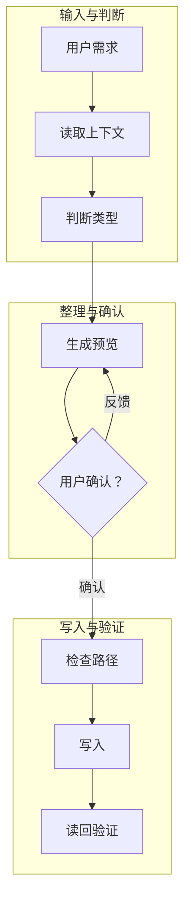

# Obsidian 视觉版式执行手册

本文件用于需要把普通 Markdown 笔记做成 Obsidian 可读版、美化版或 CSS snippet 版时读取。目标不是装饰，而是让用户更快读懂结构、状态、风险和下一步。

## 单一事实源

本文件是视觉版式的单一事实源。涉及 callout 职责、Mermaid 布局、表格视觉、CSS snippet、图标和渲染验证时，以本文件为准。

其他 reference 只说明业务结构、信息保真或项目母文档字段，不再维护另一套视觉规则。若发现其他文件与本文件冲突，按本文件执行，并把冲突作为 skill 维护问题修复。

## 执行模式

先判断本次任务属于哪一种模式，不要套同一个流程。

| 模式 | 触发信号 | 允许改什么 | 禁止改什么 |
| --- | --- | --- | --- |
| 新建沉淀 | 用户要求把材料整理成新笔记、知识卡、决策记录或项目母文档。 | 可重组 Markdown 结构，先生成冻结预览。 | 未确认前写入文件。 |
| 旧笔记重构 | 用户要求“改到愿意读”“重写旧复盘”“整理旧母文档”。 | 可调整章节、callout、表格、Mermaid 和正文表达。 | 删除事实链、来源、边界或用户确认过的内容。 |
| 轻量美化 | 用户要求“只改颜色/图标/callout/表格/CSS”“保留正文结构”。 | 只改用户确认的视觉面：CSS、callout 类型、表格样式、Mermaid 布局。 | 改页宽、字号、行高、正文主线、章节结构或新增规则说明，除非用户明确确认。 |

轻量美化模式下，先列出会修改和不会修改的范围；如果用户已经明确限定范围，直接按限定范围执行。

## 执行顺序

1. 先判断内容职责：摘要、元信息、结构定义、状态清单、流程、风险、行动项。
2. 再选择版式组件：callout、表格、Mermaid、checklist 或普通正文。
3. 按执行模式决定是否重写 Markdown：新建沉淀和旧笔记重构可以调整结构；轻量美化必须保留正文结构。
4. 写 CSS 前确认作用域，优先用 `cssclasses` 限定到当前笔记。
5. 写完后必须做读回和渲染验证，不能只检查文件存在。

## Callout 使用职责

Callout 只用于读者需要被“停一下”的信息。不要把普通正文、规则说明、长表格或所有段落都包成 callout。

| 信息类型 | 是否用 callout | 推荐类型 | 正确用法 |
| --- | --- | --- | --- |
| 30 秒读法、目标一句话、结论摘要 | 用 | `summary` | 放第一屏，帮助用户立即知道这是什么。 |
| 图示读法、阅读导航、架构读法 | 用 | `info` | 解释图或表怎么读，不写成内部规则。 |
| 决策、取舍、已确认口径 | 用 | `decision` 或 `success` | 一条 callout 只承载一个关键判断；CSS 样本必须覆盖所用类型。 |
| 风险、边界、禁止项 | 用 | `warning` | 写触发条件和后果，避免空泛提醒。 |
| 普通背景正文 | 不用 | 无 | 用自然段，避免把整篇变成卡片堆。 |
| 长表格和状态清单 | 不用 | 无 | 用表格表达，callout 最多放读法。 |
| CSS 或版式使用规则 | 通常不用 | 无 | 这是维护规则，应进 skill 或注释，不应污染母文档。 |

## Mermaid 流程图做法

成熟产品里的流程图通常遵循这些约束：

- 一个图只回答一个问题：架构图解释分层，工作流图解释动作顺序，不把所有信息塞进一张图。
- 主路径先读得通，再加分支。
- 节点短，表格负责精确定义；不要把长句塞进节点。
- 宽度受限时，不要硬做一条超长横线；用外层 `flowchart TB`，每个阶段内部 `direction LR`。
- 反馈环路只画关键闭环，不画每一次修改细节。
- Mermaid 不能替代表格，图用于扫一眼，表格用于定义边界和证据。

推荐结构：

````markdown

````

错误做法：

````markdown

````

## 错误做法

这些做法即使“有规则”，也应判定为失败：

- CSS snippet 改了颜色、图标和表格，但没有验证 Obsidian 或等价渲染环境里是否真的显示。
- 图标使用本地 SVG 相对路径做 `mask`，文件存在但渲染为空白。
- Mermaid 为了横向阅读写成一条超长 `flowchart LR`，超过正文宽度或被缩到看不清。
- 把“callout 使用规则”“CSS 规则”或 Agent 执行说明写进用户母文档正文。
- 用户只要求轻量美化时，擅自改页宽、字号、行高、正文主线或章节结构。

## 表格做法

表格用于比较、状态、边界和证据映射。不要把长段落塞进表格，也不要让表格替代正文解释。

正确做法：

- 表头必须完整连续，不能因为 CSS 选择器或空单元格造成断裂。
- 第一列用于对象或编号，后续列用于状态、理由、下一步。
- 每行表达一个完整单元，避免跨行依赖读者脑补。
- 表格太宽时优先精简列名和内容，不要缩小正文全局字号。

## CSS Snippet 做法

CSS snippet 只负责视觉层，不负责改写内容。必须限定作用域：

```yaml
---
cssclasses:
  - okc-css-showcase
---
```

推荐选择器：

```css
.markdown-preview-view.okc-css-showcase {
  --okc-accent: #0071e3;
}
```

图标建议：

- 优先使用内联 `data:image/svg+xml;base64,...`，减少 Obsidian 对 snippet 相对路径的解析差异。
- 如果使用本地 SVG 文件，必须在 Obsidian 中实际验证显示；不能只凭路径存在判断。
- 图标应挂在稳定文本伪元素上，例如 `.callout-title-inner::before`，并给定明确尺寸。

图标验证至少检查：

- 伪元素 `display` 不是 `none`。
- `width` 和 `height` 不为 `0px`。
- `background-color` 或 `color` 可见。
- `mask-image` 或 `-webkit-mask-image` 不是 `none`。

## 验证流程

视觉版交付前必须说明采用了哪一级验证，不能笼统写“已验证”。

| 验证级别 | 使用条件 | 必做检查 | 交付表述 |
| --- | --- | --- | --- |
| Obsidian 实测 | 能打开目标 vault 或用户截图反馈可用。 | 刷新 CSS snippets 或重载窗口；检查图标、callout、表格表头、Mermaid 宽度。 | “已在 Obsidian 中验证”。 |
| 等价渲染验证 | 无法直接操作 Obsidian，但可使用 Chromium/Electron 类环境。 | 用最小 DOM + CSS 检查伪元素尺寸、`mask-image`、表格表头连续性、Mermaid 容器约束。 | “已做浏览器层验证，不能完全替代 Obsidian 实测”。 |
| 代码级检查 | 无法做任何渲染。 | 读回文件，检查作用域、选择器、callout 类型、Mermaid 方向和样本引用。 | “仅完成代码级检查，尚未验证渲染”。 |

若图标、Mermaid 或表格任一项无法验证，不要声称视觉验收通过。

## 正确样本

需要完整可复制样本时，使用：

- `assets/okc-showcase-template.md`
- `assets/okc-showcase-snippet.css`

样本只作为起点。使用时必须按用户笔记内容删改，不要把样本说明原样塞进用户母文档。
